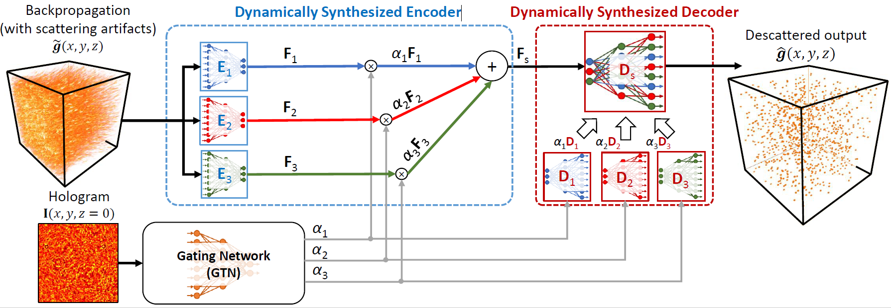

# DynamicSyntesisNetwork

This is the implementation of the dyniamic synthesis network (DSN) for large-scale 3D descattering, as presented in our publication:

W.Tahir, L. Tian, "Adaptive 3D descattering with a dynamic synthesis network", arXiv (2021), 2107.00484

https://arxiv.org/abs/2107.00484

**Figure:** DSN Schematic

# Training new model
* The script **Train_new_model/main_train.py** contains the code for training the network. 

* In order to train the model, the data can be downloaded from the following google drive link:
https://drive.google.com/drive/folders/1q5hliaW8NVGyA74BP49uqaWpJdVPOmiA

* Download the 'data' folder from the above link and copy it to the 'Train_new_model' folder, such that it's path is **.../Train_new_model/data**

* To begin training, execute the script main_train.py as follows:

$ python main_train.py

# Using pretrained DSN model for testing

* We provide a pretrained model and a script which can use the pretrained model to descatter a test 3D backpropagation volume. 

* In order to perform descattering on a test-3D-backpropagation (not used in the training process), download the folder 'test_data' and 'chkpt' from the following google drive link:
https://drive.google.com/drive/folders/1q5hliaW8NVGyA74BP49uqaWpJdVPOmiA

* Copy the downloaded 'test_data' and 'chkpt' folders to the 'Test_trained_model' folder, such that their path is **'.../Test_trained_model/test_data'** and  **'.../Test_trained_model/chkpt'**. 

* In the folder **Test_trained_model**, execute the script main_test.py as follows:

$ python main_test.py

* The model will perform descattering on all test data and save results in the folder 'test_results'

## Dependencies
**environment.yml** lists dependencies used to run this code on an Nvidia RTX-8000 GPU.

